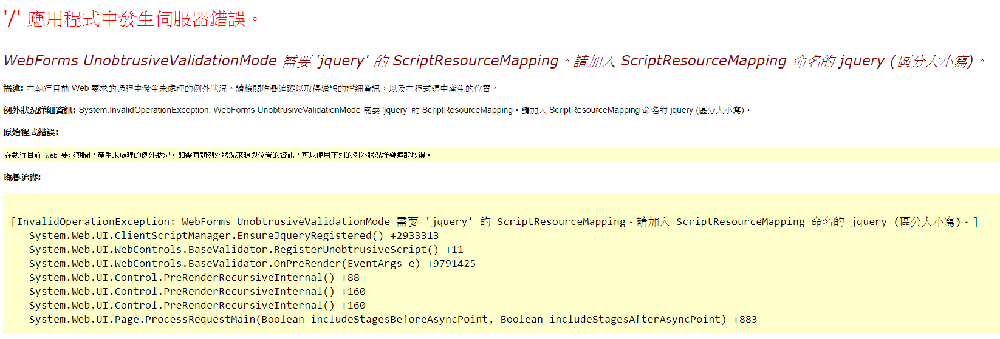

## 20190312上課筆記
關於帳號密碼
### 首頁
Default.aspx
```html
<h1>我是首頁</h1>
<asp:HyperLink ID="sign_in" NavigateUrl="login.aspx" runat="server">會員登入</asp:HyperLink><br>
<asp:HyperLink ID="manager" NavigateUrl="member.aspx" runat="server">會員管理</asp:HyperLink><br>
<asp:HyperLink ID="report" NavigateUrl="Report.aspx" runat="server">報表查詢</asp:HyperLink><br>
<asp:LinkButton ID="LinkButton1" runat="server" OnClick="LinkButton1_Click">會員登出</asp:LinkButton>
```

#### hyperlink vs LinkButton
1. hyperlink  一般的超連結
2. LinkButton 會連到server


### 驗證帳密或密碼是否為空
* 客戶端驗證
* 使用元件
工具箱 > 驗證 > RequiredFieldValidator
login.aspx
```csharp
<asp:RequiredFieldValidator ID="RequiredFieldValidator1" runat="server" ControlToValidate="acc" ErrorMessage="帳號不可為空白" ForeColor="Red" Display="Dynamic" ></asp:RequiredFieldValidator>
<asp:RequiredFieldValidator ID="RequiredFieldValidator2" runat="server" ControlToValidate="pwd" ErrorMessage="密碼不可為空白" ForeColor="Red" Display="Dynamic" ></asp:RequiredFieldValidator>
```
運行錯誤

因為有jQuery的關係所以要在login.aspx.cs 加上UnobtrusiveValidationMode = UnobtrusiveValidationMode.None;才可以
login.aspx.cs 
```csharp
    protected void Page_Load(object sender, EventArgs e)
    {
        UnobtrusiveValidationMode = UnobtrusiveValidationMode.None;
    }
```

### Session
* 伺服器端記憶體存取資料的集合
* 可以跨網頁
```csharp
Session["UserID"] = "john";
Session["UserRole"] = 1;
```

### Sql
存字元的變數
類別|說明|例子|
-|-|-|
var||身分證字號
nvar| (n)如果伺服器架到國外要用|
varchar |(var可變動的) 會多記長度|地址
nvarchar|
ps: 一個中文字佔兩個bite

#### 查詢
```sql
select * from Member where address like N'金門縣%';
```
```sql
like N'金門縣%'
```
1. like :查詢相似的 
2. % :甚麼內容沒差   (vs _配對一個字,ex: \_門\_)
3. N :中文的關係所以'金門縣'前要加N


  