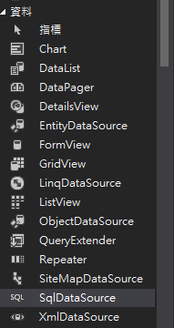
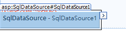
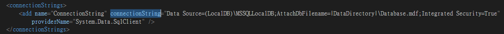

# 20190319 ConnetDatabase

## Sql語法 

### 插入
```sql 
insert into Member(user_id,user_password,user_name,address,tel)values('john','0927','john','123','0930917870');
```
### 刪除
```sql
delete from Member where user_id = 'john';
```
### 更新
```sql
update Member set user_password = 'abcdefd' where user_id = 'john';
```
### 查詢(倒敘)
```sql
select * from Member order by user_id desc;   
```
* desc (倒敘) 默認是直敘

## 連結資料庫

```sql
    protected void Button1_Click(object sender, EventArgs e)
    {
        string id = acc.Text;
        string password = pwd.Text;

        SqlConnection conn = new SqlConnection(WebConfigurationManager.ConnectionStrings["connectionString"].ToString());
        conn.Open();
        SqlCommand cmd = new SqlCommand();
        cmd.Connection = conn;
        cmd.CommandText = "SELECT * FROM [Member] WHERE [user_id] = @input1 AND [user_password] = @input2";
        cmd.Parameters.Clear();
        cmd.Parameters.AddWithValue("@input1", id);
        cmd.Parameters.AddWithValue("@input2", password);
        SqlDataReader reader = cmd.ExecuteReader();
        if (reader.HasRows)
        {
            reader.Read();
            string user_id = reader["user_id"].ToString();
            string user_name = reader["user_name"].ToString();
            Session["UserID"] = user_id;
            Session["UserName"] = user_name;

        }
        reader.Close();
        conn.Close();
        if (Session["UserID"] != null)
        {
            Response.Redirect("member.aspx");
        }

    }
```
### 簡化連接資料庫(元件) 語法

 
工具箱 > 資料 > SqlDataSource

查看設計



* 點擊 > 
* 設定完之後
* 查看Web.config


回login.aspx.cs ㄒ
修改conn
```csharp
Connection conn = new SqlConnection(WebConfigurationManager.ConnectionStrings["connectionString"].ToString());
```

### 再利用元件更簡化
```csharp
    protected void Button1_Click(object sender, EventArgs e)
    {
        string id = acc.Text;
        string password = pwd.Text;

        SqlDataSource1.SelectParameters["user_id"].DefaultValue = id;
        SqlDataSource1.SelectParameters["user_password"].DefaultValue = password;
        SqlDataSource1.DataSourceMode = SqlDataSourceMode.DataReader;
        SqlDataReader reader = (SqlDataReader)SqlDataSource1.Select(DataSourceSelectArguments.Empty);
        if (reader.HasRows)
        {
            reader.Read();
            string user_id = reader["user_id"].ToString();
            string user_name = reader["user_name"].ToString();
            Session["UserID"] = user_id;
            Session["UserName"] = user_name;
        }
        SqlDataSource1.Dispose();

        if (Session["UserID"] != null) Response.Redirect("Default.aspx");
```