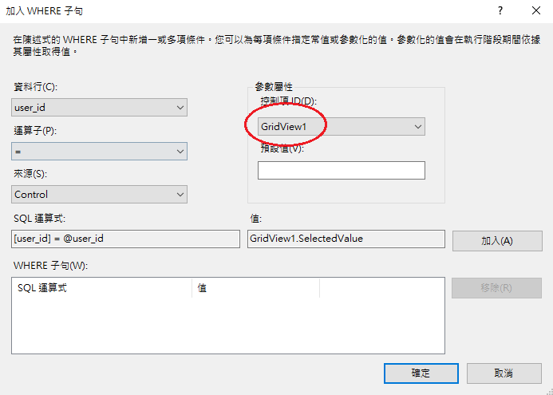
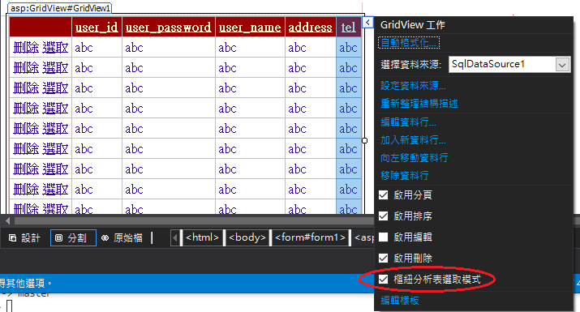
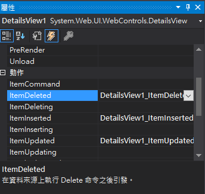
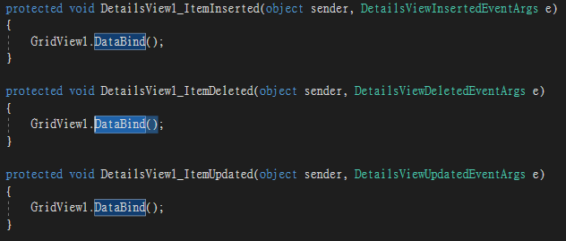
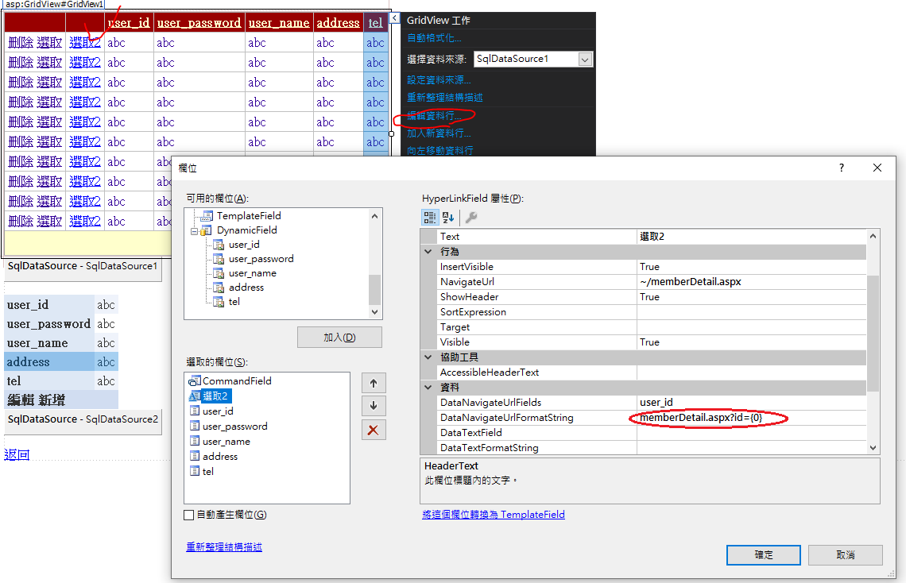
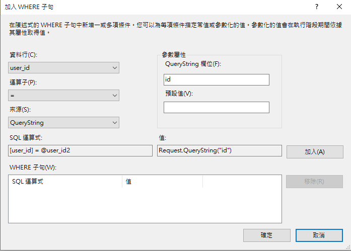
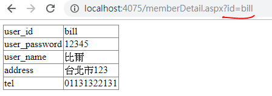

##  20190409 GridView＆DetailsView

###  GridView
工具箱>資料

\>SqlDataSource
設定資料夾來源

\>GridView
選擇資料夾來源
### DetailsView 
\>DetailsView
選擇資料夾來源

* 可以插入資料(GridView無法插入資料)

### DetailsView 連接GridView
DetailsView 連接GridView

GridView添加樞紐分析表選取模式

### 同步顯示(DataBind) 
修改DetailsView，GridVie同步改變資料

member.aspx.cs

### 超連接轉換
兩個頁面，藉由網址傳輸訊息，使頁面改變

member.aspx

對應網頁網址: memberDetail.aspx?id={0}

memberDetail.aspx

QuerString 可以接收網址欄位的資訊

