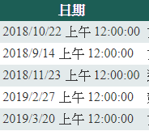

##　20190423

### 標題改成連結


###　日期簡化



### 點擊數

SqlDataSource2
修改
```csharp
 <asp:SqlDataSource ID="SqlDataSource2" runat="server" ConnectionString="<%$ ConnectionStrings:ConnectionString %>" DeleteCommand="DELETE FROM [Detail] WHERE [Id] = @Id" InsertCommand="INSERT INTO [Detail] ([count], [Id]) VALUES (@count, @Id)" SelectCommand="SELECT [count] , [Id] FROM [Detail] WHERE ([Id] = @Id)" UpdateCommand="UPDATE [Detail] SET [count] = @count
 WHERE [Id] = @Id">
```

 把SET [count] = @count修改成SET [count] = [count] + 1

Detail.aspx

```csharp
         if(Request.QueryString["id"] != null)
        {
            string id = Request.QueryString["id"].ToString();
            SqlDataSource2.UpdateParameters["id"].DefaultValue = id;
            SqlDataSource2.Update();
        }
```