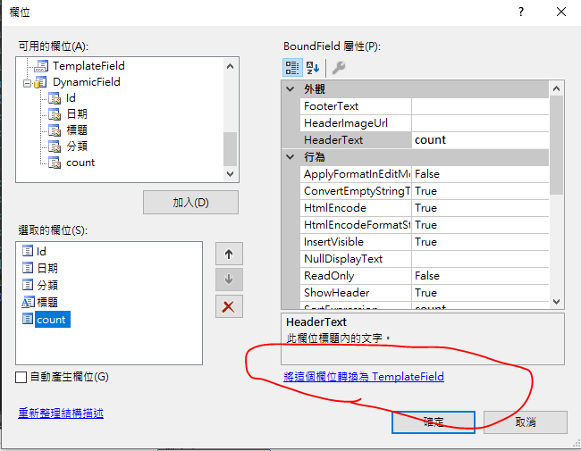
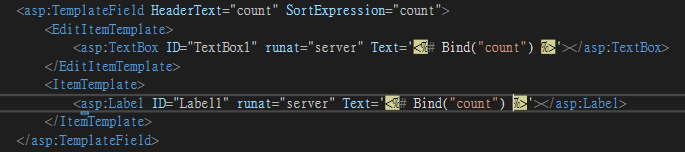
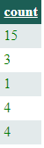
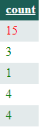
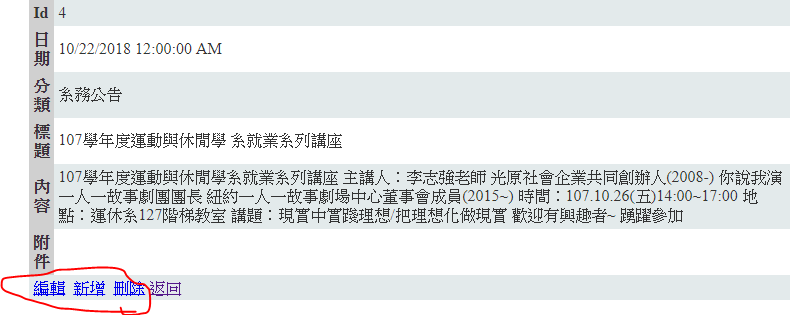
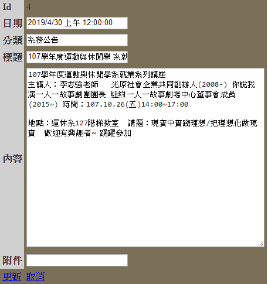
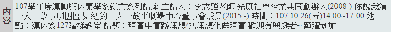
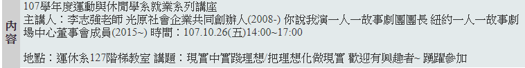

## 20190430 TemplateField

### BoundField轉成TemplateField





```csharp
Bind("count")
```
bind 資料聯繫，能連到資料庫

### 點擊超過10就改顏色
```csharp
<asp:Label ID="Label2" runat="server" Text='<%# Bind("count") %>' ForeColor="Green"></asp:Label>
```



```csharp
<asp:Label ID="Label1" runat="server" Text='<%# Bind("count") %>' ForeColor='<%# int.Parse(Eval("count").ToString()) > 10 ? System.Drawing.Color.Red : System.Drawing.Color.Green %>'></asp:Label>
```
Eval("count") 相比 Bind("count") 它能夠雙向連接



### 編輯修改刪除(進階)


```csharp
<ItemTemplate>
 <asp:LinkButton ID="LinkButton1" runat="server" CausesValidation="False" CommandName="Edit" Text="編輯" Visible='<%# Session["UserID"] == null ? false:true %>'></asp:LinkButton>
 &nbsp;<asp:LinkButton ID="LinkButton2" runat="server" CausesValidation="False" CommandName="New" Text="新增" Visible='<%# Session["UserID"] == null ? false:true %>'></asp:LinkButton>
 &nbsp;<asp:LinkButton ID="LinkButton3" runat="server" CausesValidation="False" CommandName="Delete" Text="刪除" Visible='<%# Session["UserID"] == null ? false:true %>'></asp:LinkButton>
 <a href="Default.aspx">返回<a>
</ItemTemplate>
```
```csharp
Visible='<%# Session["UserID"] == null ? false:true %>'
```

### 內容修改



```csharp
  <asp:TemplateField HeaderText="內容" SortExpression="內容">
      <EditItemTemplate>
          <asp:TextBox ID="TextBox2" runat="server" TextMode="MultiLine" Height="300px" Width="400px" Text ='<%# Bind("內容") %>'></asp:TextBox>
      </EditItemTemplate>
      <InsertItemTemplate>
          <asp:TextBox ID="TextBox2" runat="server" TextMode="MultiLine" Height="300px" Width="400px" Text='<%# Bind("內容") %>'></asp:TextBox>
      </InsertItemTemplate>
      <ItemTemplate>
          <asp:Label ID="Label2" runat="server" Text='<%# Bind("內容") %>'></asp:Label>
      </ItemTemplate>
  </asp:TemplateField>
```
```csharp
TextMode="MultiLine" Height="300px" Width="400px"
```
MultLine使內容可以跳行

### 顯示跳行



修改之後



因為Lable看不懂跳行，所以要把\r\n轉成\<br>
```csharp
<asp:Label ID="Label2" runat="server" Text='<%# Eval("內容").ToString().Replace("\r\n","<br/>") %>'></asp:Label>
```

