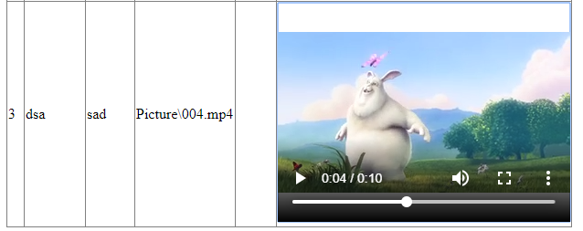
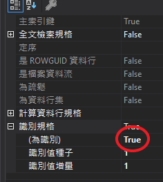
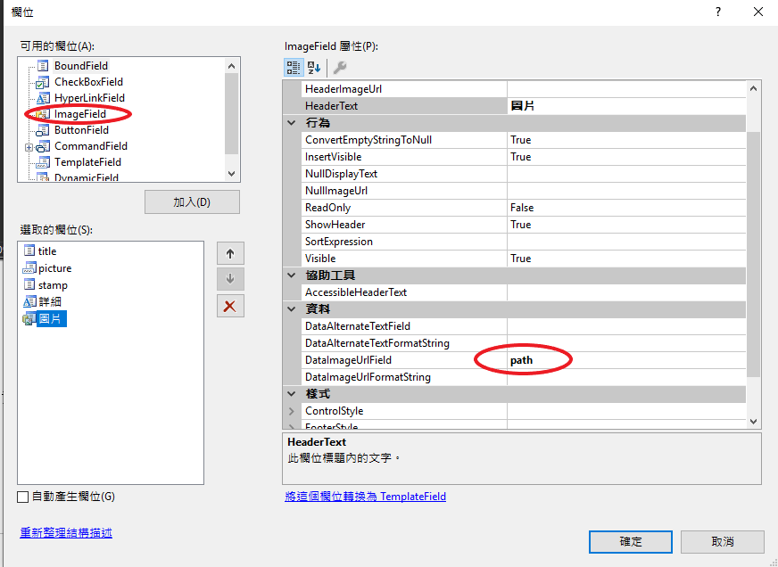
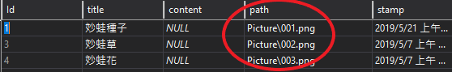

## 製作相簿

### 把圖片存在傳統硬碟裡

vs 都存在資料庫的，這能避免資料庫儲存的量減少很多

DB 適合存比較零碎且資料量少的資料

### 影片
```csharp
 <video  width="320" height="240" controls>
   <source  id="sd" runat="server" src='<%# Bind("path") %>' type="video/mp4">
   <source  id="sdsad" runat="server" src='<%# Bind("path") %>' type="video/ogg">
   Your browser does not support the video tag.
 </video>
```


### id依序自動編號

設計資料表 > 屬性



### 連接圖片

１．加入ImageFeild 
２．DataImageUrlField 加入path
path 為資料表中欄位 




path要設定相對位置，絕對位置的話要特別設定iis user
