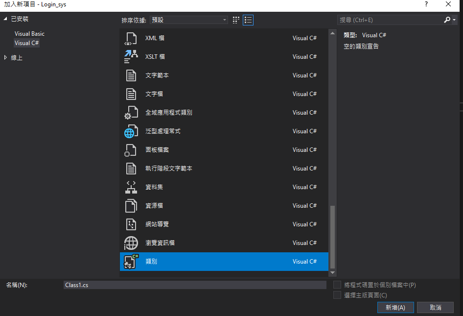

# 顯示視窗
```html
 <input id="b" type="button" onclick="alert('hello')"></input>
```

### 建立元件

加入類別



```csharp
public class AlertMessage
{
    public static void MessageBox(Page page ,string msg)
    {
        string script = "<script>alert('"+msg+"')</script>";
        page.ClientScript.RegisterStartupScript(page.GetType(), "Message", script);
    }
}
```

使用元件
```csharp
    protected void Button1_Click(object sender, EventArgs e)
    {
        string msg = "Hello World";
        AlertMessage.MessageBox(this, msg);
    }
```