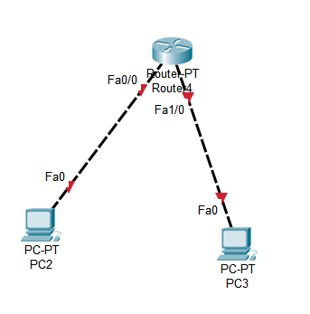
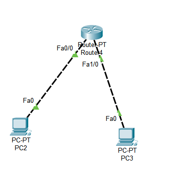
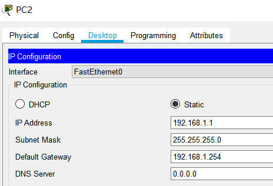
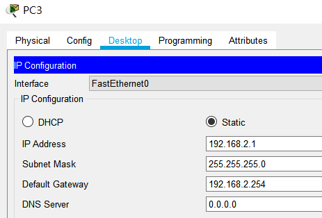
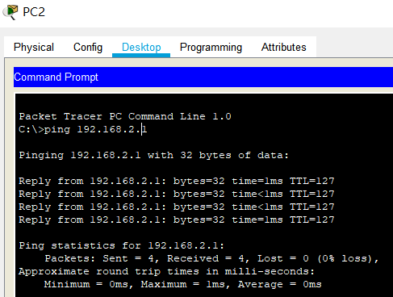

##### switch 
* layer2
* layer3
* vlan

stp(spanning tree protocol)
etherchannel

----------
### cisco
* show version
* show flash  可以看到映像黨

\> user mode 
```
Router>enable 
```
\#priviledge mode
```
Router#config
```
root(config)#全局模式

### 路由器簡單設定

進入介面
```
//兩個都可以
Router(config)#interface fastEthernet 0/0
Router(config)#int fa0/0
```
設定閘道
```
Router(config)#int fa0/0
Router(config-if)#ip addr 192.168.1.254 255.255.255.0
Router(config-if)#no shutdown //啟動
Router(config-if)#int fa1/0
Router(config-if)#ip addr 192.168.2.254 255.255.255.0
Router(config-if)#no shutdown //啟動
```
查看是否設定完成
```
Router#show ip interface brief 

Interface              IP-Address      OK? Method Status                Protocol 
FastEthernet0/0        192.168.1.254   YES manual up                    up 
FastEthernet1/0        192.168.2.254   YES manual up                   
```


#### pc設定


##### PC2 ping PC3
