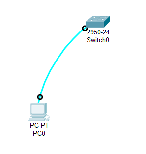
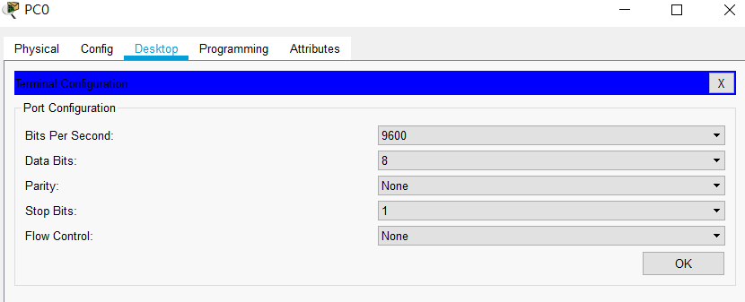
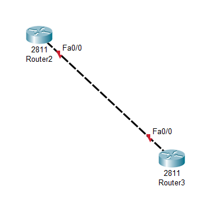
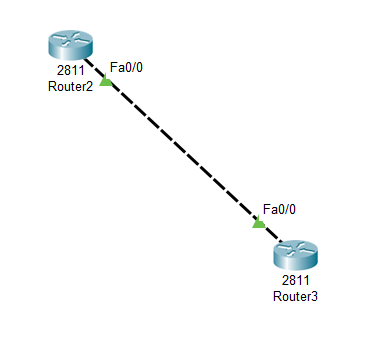
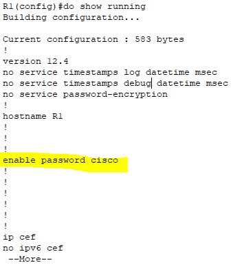
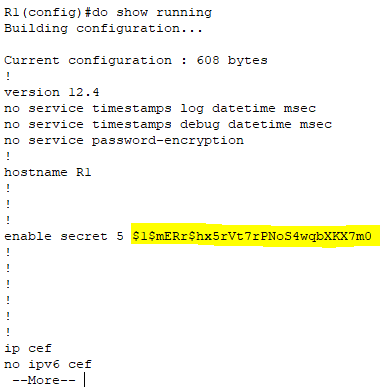
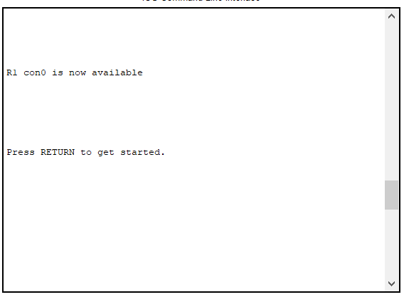
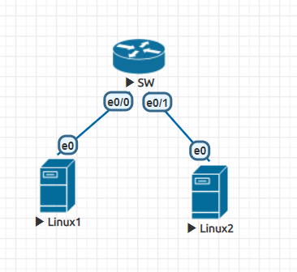

# 操作交換機或路由器
1. console
2. aux
3. telnet (ssh)

[上課影片](https://youtu.be/DkDnT6LGtRA)
## 交換機
PC連swich的console來操作



## 路由器操作(telnet)
### 設定IP


Router2
```
Router(config)#hostname R1
R1(config)#
R1(config)#int f0/0
R1(config-if)#ip addr 12.1.1.1 255.255.255.0
R1(config-if)#no shutdown
```
Router3
```
Router(config)#hostname R2
R2(config)#
R2(config)#int f0/0
R2(config-if)#ip addr 12.1.1.2 255.255.255.0
R2(config-if)#no shutdown
```


### 設定特權密碼
```
R1(config)#enable password cisco
R1(config)#show running
R1(config)#do show running
```

明文密碼會顯示出來
如要不要讓密碼明文顯示的話
```
R1(config)#no enable password   把之前的密碼刪掉
R1(config)#enable secret cisco
R1(config)#do show running
```

之後進入超級使用者時都要輸入密碼

```
R1>en
Password: 
R1#
```
### 設定telnet
Router2
```
R1(config)#line vty 0 4
R1(config-line)#password ccna
R1(config-line)#login
R1(config-line)#exit
R1(config)#
```
Router3
```
R2#telnet 12.1.1.1
Trying 12.1.1.1 ...Open


User Access Verification

Password:  
R1>
```
遠端登入成功

### CISCO重要操作
#### 儲存設定
```
R1#copy running-config  startup-config
```

如果指令亂打，要會復原狀按Ctrl+Shift+6
```
R1#sadasdsad
Translating "sadasdsad"...domain server (255.255.255.255) % Name lookup aborted
R1#
```
如果要避免打錯都要這樣的話
```
R1(config-line)#no ip domain-lookup
R1(config)#asdasda
            ^
% Invalid input detected at '^' marker.
	
R1(config)#
```
#### 設定螢幕保護
```
R1(config)#line console 0
R1(config-line)#exec-timeout 0 5
R1(config-line)#
```

取消
```
R1(config-line)#no exec-timeout
```
#### 另外
老師說很重要
```
logging sync
```
## EVE Switch操作
switch 本身不用做設定，只要開機線連好就可以傳封包了



###　設定IP

剛建立起來的虛擬機還沒設定好ip，所以現在來手動設定

linux要先成為超級使用者
```
$sudo passwd root    ##設定root密碼 
$su
```

Linux1
```
ifconfig eth0 12.1.1.1 netmask 255.255.255.0
```
Linux2
```
ifconfig eth0 12.1.1.2 netmask 255.255.255.0
```
### 測試
Linux1 ping Linux2
```
ping 12.1.1.2
```
linux1有ping到話，代表switch有發會傳遞封包的功能
[上課影片](https://youtu.be/m1TRbXtpyD4)
