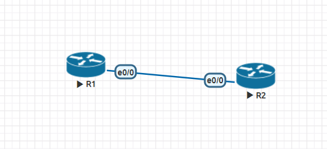
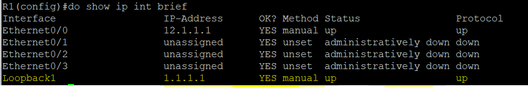
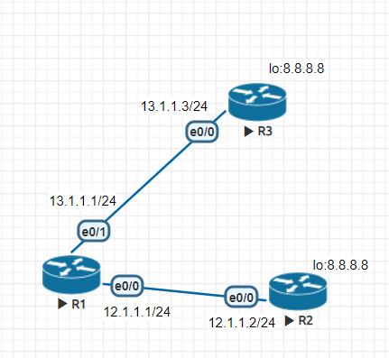
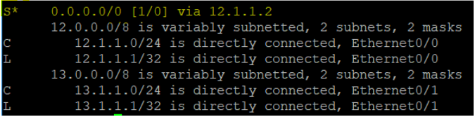
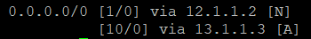
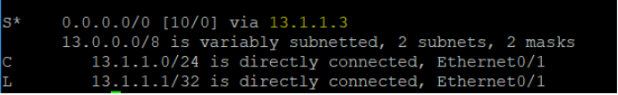

# 浮動路由
### 先前路由設定

#### R1
先設定好ip
```
R1(config-if)#ip addr 12.1.1.1 255.255.255.0
R1(config-if)#no shut
```
設定loopback
```
R1(config-if)#int lo 1
R1(config-if)#ip addr 1.1.1.1 255.255.255.255
```
查看是否建立
```
R1(config-if)#do show ip int brief
```

> loopback 設定好就是開啟的，不用no shut
#### R2
跟R1一樣設定
```
R2(config-if)#ip addr 12.1.1.2 255.255.255.0
R2(config-if)#no shut
R2(config-if)#int lo 1
R2(config-if)#ip addr 2.2.2.2 255.255.255.255
```
### R1 ping R2
```
R1#ping 12.1.1.2 source 1.1.1.1
```
失敗
> 因為R2路由表沒有1.1.1.1所以不會回送封包

### 靜態路由設定
R2
```
R2(config)#ip route 1.1.1.1 255.255.255.255 12.1.1.1
```
設定好就可以ping到了

## 浮動路由

R2
```
R3(config-if)#int lo 1
R3(config-if)#ip addr 8.8.8.8 255.255.255.255
```
R3
```
R3(config-if)#ip addr 13.1.1.3 255.255.255.0
R3(config-if)#int lo 1
R3(config-if)#ip addr 8.8.8.8 255.255.255.255
```
R1
```
R1(config)#ip route 0.0.0.0 0.0.0.0 12.1.1.2
R1(config)#ip route 0.0.0.0 0.0.0.0 13.1.1.3 
```
R1連到R3的連線ad設為10，預設為1，ad值越高越不會傳封包傳過去
```
R1(config)#ip route 0.0.0.0 0.0.0.0 13.1.1.3 10
```
查看路由表
```
R1(config)#do show ip route
```

```
R1(config)#do show ip static route 0.0.0.0/0
```
 

ping 8.8.8.8
```
R1(config)#ping 8.8.8.8 
```
> 會傳到R2

停掉R1 e0/0的介面卡，路由表就會顯示R3的ip位址

這時因為R1-R2的連線斷掉，所以R1-R3的連線就會啟用

