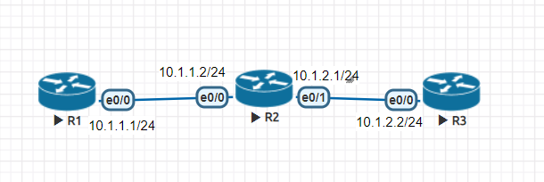
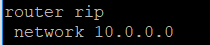
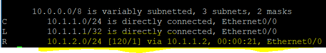
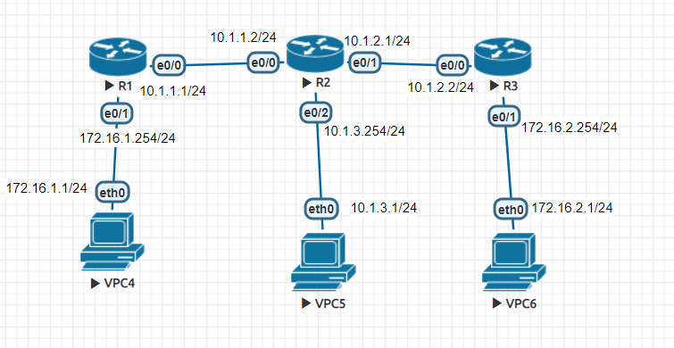
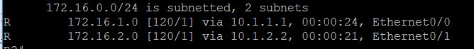

# RIP


R1
```
router rip
network 10.1.1.1
```
不管打
network 10.1.1.1
network 10.1.0.0
network 10.0.0.0
都可以
因為show ip route查看



再來查看
```
show ip route
```

> 因為有使用RIP尋徑所以可以找到10.1.2.0

再來R2 R3設定
```
router rip
network 10.0.0.0
```
然後R1 ping R3 就可以ping到 

## 進階

R1
```
router rip 
version 2
network 10.1.1.1
network 172.16.1.254
```
R2
```
router rip 
version 2
network 10.1.3.254
```
R3
```
router rip
version 2
network 10.1.1.1
network 172.16.2.254
```
> network 10.1.1.1 會直接成那整個區段
10.1.1.1是10.0.0.0 網路A區段；172.16.2.254 是172.16.0.0的區段

但這樣設定完會發現VPC4無法pingVPC6，VPC5也無法ping到VPC6，10.1.2.0的線路像是被評避掉一樣
查看R2的路由表
```
      172.16.0.0/24 is subnetted, 2 subnets
R        172.16.0.0 [120/1] via 10.1.1.1, 00:00:24, Ethernet0/0
R        172.16.0.0 [120/1] via 10.1.2.2, 00:00:21, Ethernet0/1
```
以上的可以查看到172.16.0.0的路由有兩條等價路由，因此會走10.1.1.1的線路而不會走10.1.2.2的路，所以才ping到VPC6
### 解決方法
到R1跟R3使用一下指令
```
R1(config-router)#no auto-summary
R3(config-router)#no auto-summary
```

p.s要消除路由表的紀錄
```
#clear ip route *
```
查看rip詳細資料
```
#show ip protocol
```

