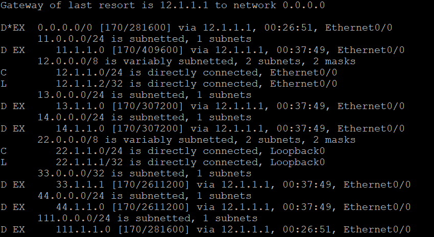

# 路由重發佈(Route Redistribution)


https://www.bilibili.com/video/av31147932?from=search&seid=13034008943090492410

1. 直連
    rip/eigrp : redistribute connected
    ospf : redistribute connected subnets
2. 靜態路由
    rip/eigrp : redistribute static
    ospf : redistribute static subnets
> ospf default route : default-information originate
```
<static route example>
#default 
ip route 0.0.0.0 0.0.0.0 null 0
#static example
ip route 111.1.1.0 255.255.255.0 null 0
```

3. 動態路由
rip : redistribute eigrp 90 metric 2  
eigrp :  redistribute rip metric 1000 100 255 100 1500   
ospf : redistribute rip (eigrp 90) subnets 

最後R2結果




# Vlan


```
Switch(config-if)#int 0/0
Switch(config-if)#switchpoint mode access
Switch(config-if)#switchpoint access vlan 10
Switch(config-if)#int 0/1
Switch(config-if)#switchpoint mode access
Switch(config-if)#switchpoint access vlan 20
.
.
```
vlan 10 環境下的VPC6、VPC8可以互ping，而VPC6、ping無法到VPC7