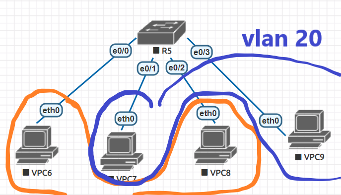

# Vlan

https://www.jannet.hk/zh-Hant/post/virtual-lan-vlan/



```
Switch(config-if)#int e0/0
Switch(config-if)#switchpoint mode access
Switch(config-if)#switchpoint access vlan 10

Switch(config-if)#int e0/1
Switch(config-if)#switchpoint mode access
Switch(config-if)#switchpoint access vlan 20

Switch(config-if)#int e0/2
Switch(config-if)#switchpoint mode access
Switch(config-if)#switchpoint access vlan 10

Switch(config-if)#int e0/3
Switch(config-if)#switchpoint mode access
Switch(config-if)#switchpoint access vlan 20
```
vlan 10 環境下的VPC6、VPC8可以互ping，而VPC6、ping無法到VPC7