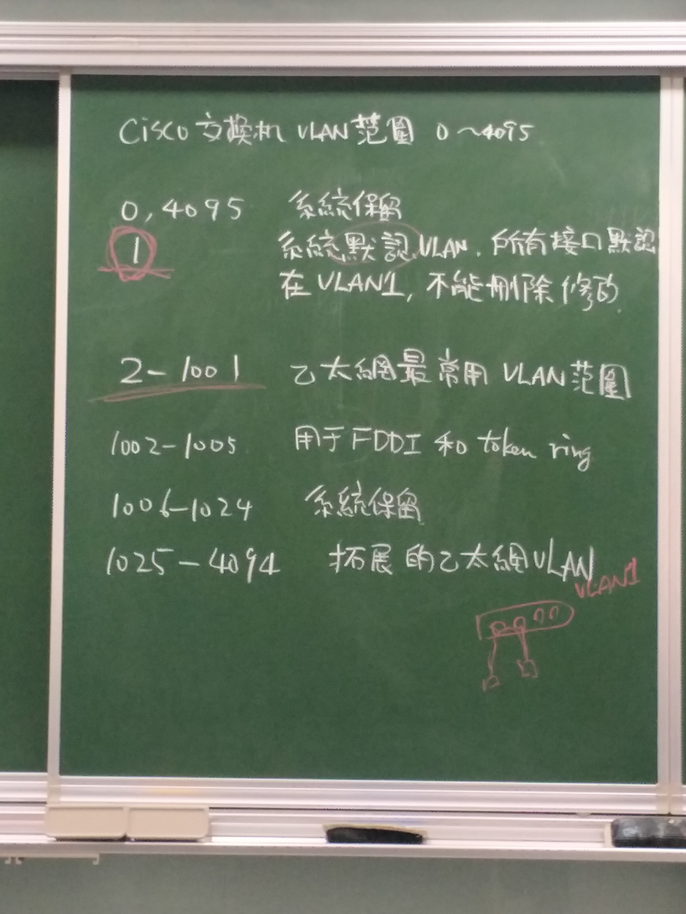

# Vlan

https://www.jannet.hk/zh-Hant/post/virtual-lan-vlan/





```
Switch(config)#int e0/0
Switch(config-if)#switchport mode access
Switch(config-if)#switchport access vlan 10

Switch(config-if)#int e0/1
Switch(config-if)#switchport mode access
Switch(config-if)#switchport access vlan 20

Switch(config-if)#int e0/2
Switch(config-if)#switchport mode access
Switch(config-if)#switchport access vlan 10

Switch(config-if)#int e0/3
Switch(config-if)#switchport mode access
Switch(config-if)#switchport access vlan 20
```
vlan 10 環境下的VPC6、VPC8可以互ping，而VPC6、ping無法到VPC7

### 補充
其實你可以幫vlan 先取好名稱
```
Switch(config)#vlan 10
Switch(config-vlan)#name orange
Switch(config-vlan)#vlan 20
Switch(config-vlan)#name blue
Switch(config-vlan)#exit
```
然後可以確認一下
```
Switch(config)#do show vlan

VLAN Name                             Status    Ports
---- -------------------------------- --------- -------------------------------
1    default                          active    
10   orange                           active    Et0/0 Et0/2
20   blue                             active    Et0/1 Et0/3
1002 fddi-default                     act/unsup
1003 token-ring-default               act/unsup
1004 fddinet-default                  act/unsup
1005 trnet-default                    act/unsup
```