# Trunk 通道
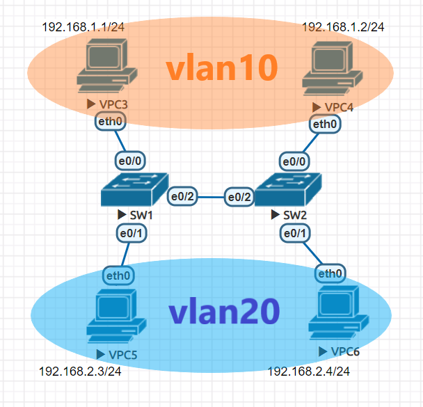
## 建立trunk
SW1、SW2都要創建
```
int e0/2
SW2(config-if)#switchport trunk encapsulation dot1q

SW2(config-if)#switchport mode trunk
```
```
do show int trunk
```
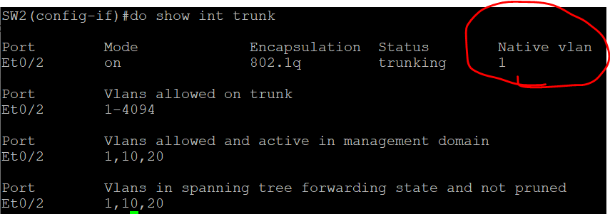

抓封包試試看

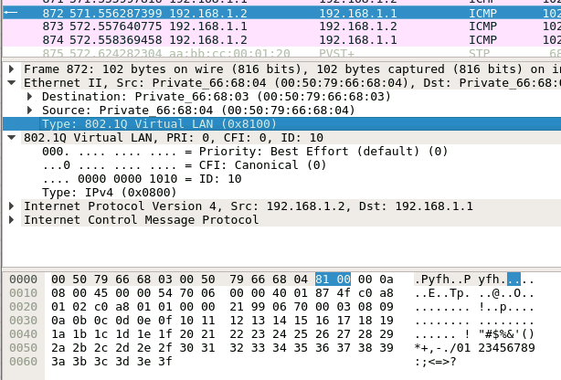


vlan ID

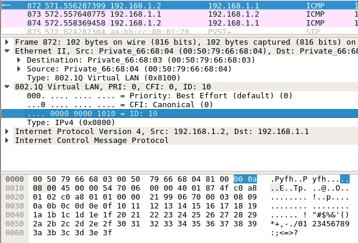

## 修改native vlan值
```
switchport trunk native vlan 10
```
> native vlan值只能設一個

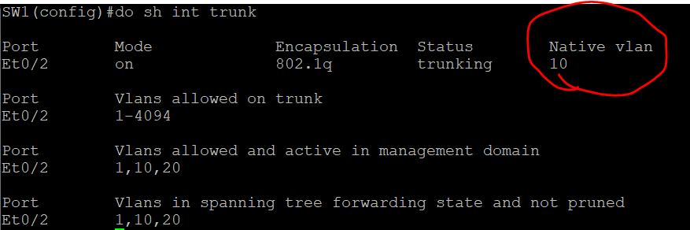

這樣vlan 10 封包不會有標籤

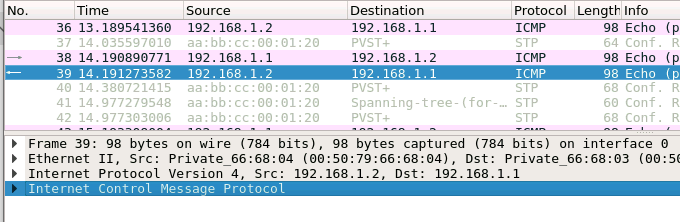

vlan 20 還是會有標籤

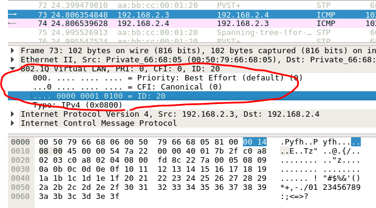

## DTP (Dynamic Trunk Protocol)
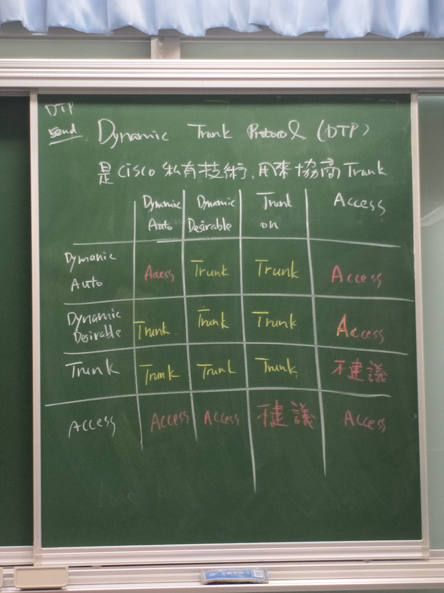

已手工進行trunk的設定，不需要DTP進行協商，進行以下指令停用DTP

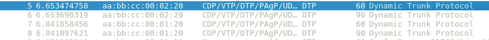
```
switchport nonegotiate
```
### <作業>用以下指令可以測試是否能建立能trunk
兩方設desirables
```
switchport mode dynamic desirables
```
兩方設auto
```
switchport mode dynamic auto
```
用以下指令來看trunk是否建立起來
```
do show int trunck
```


## VTP 模式

> 要先有trunk才能有VTP

思科技私有技術
用於實現對vlan的全局管理(創建刪除、修改)

server : 能創建、刪除、修改vlan
client : 不能創建、刪除、修改vlan，但能學習轉發
transparent : 能創建、刪除、修改vlan，但不能學習轉發

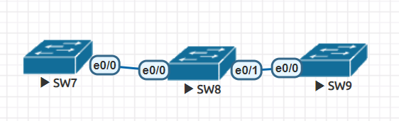

SW7設為server，SW8、SW9為client
```
SW1(config)#vtp domain cisco
SW1(config)#vtp password ccna
SW1(config)#vtp mode (server|client)
```
```
SW1(config)#do show vtp status
```
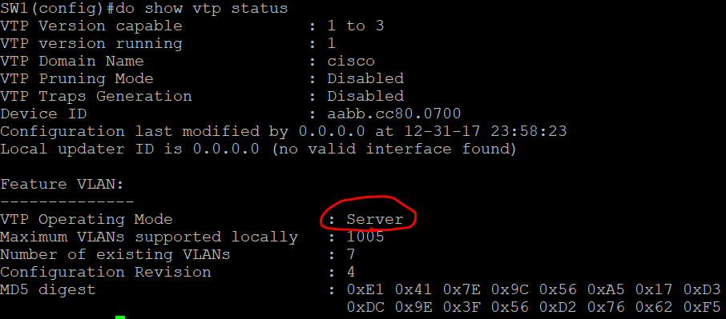

建置3個vlan
```
SW1(config)#vlan 10
SW1(config)#vlan 20
SW1(config)#vlan 30
```
只要把trunk連線建立起來，vlan就能建置到兩台client端上


