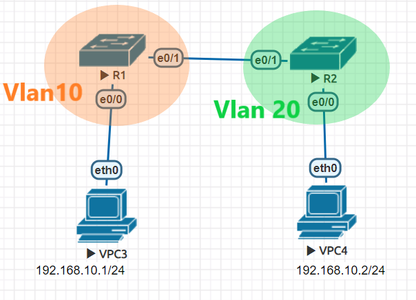
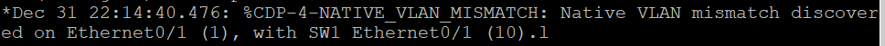
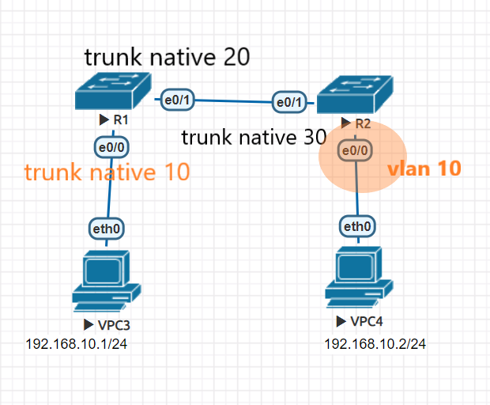
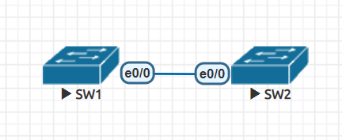
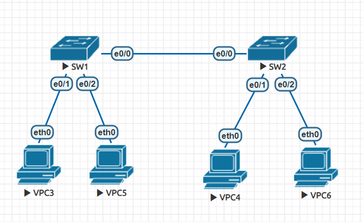
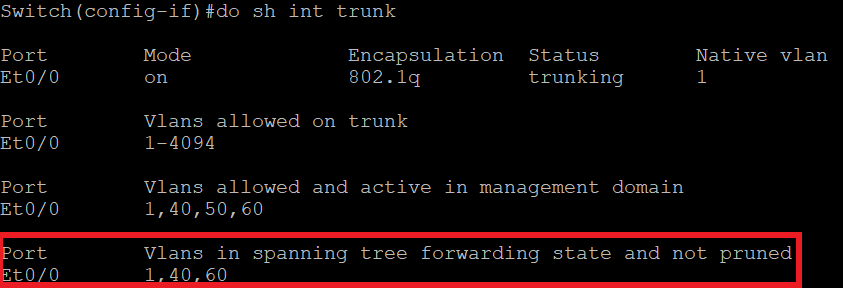
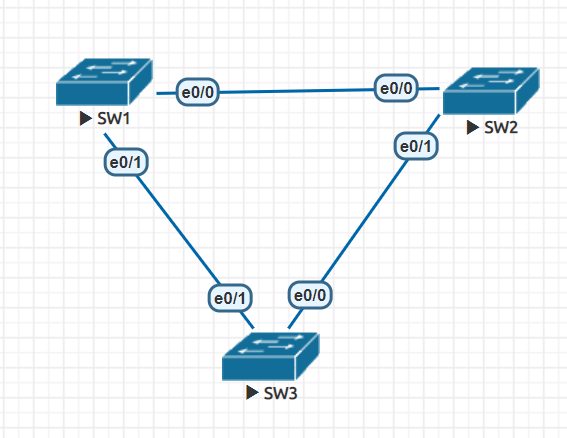
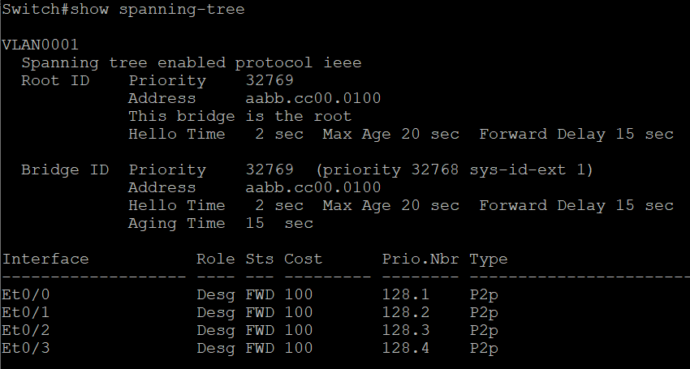

# Vlan

## example 1

能否互ping?



只有cisco的機器會出現這樣的訊息



在兩台機器上執行以下指令
```
no cdp advertise-v2
```
### 結論
可以，vpc3傳封包到SW1 e0/0時會加上vlan10標籤，到e0/1時會刪除vlan10標籤，到SW2時也是一樣的操作，所以互ping

-------------
>p.s.
要快速消除介面卡上的指令以下
default int range e0/0, e0/1

## example 2
能否互ping?



可以，因為有vlan10標籤的封包到SW1的e0/0接口時，vlan10標籤就會被拿掉(trunk native 10代表 vlan 10 不會帶有標籤)

# vtp



一開始SW1、SW2分別為server、client，
SW1創建vlan10~30，

# vtp pruning 


```
vtp pruning
```
```
show int trunk
```


# STP
可參考資料: https://www.jannet.hk/zh-Hant/post/spanning-tree-protocol-stp/#step3


```
show spanning-tree
```


如何決定Root :
* priority + vlan值 + MAC address值

如何決定DP(designated port) :
1. cost
2. BID
3. MAC address
4. PID
