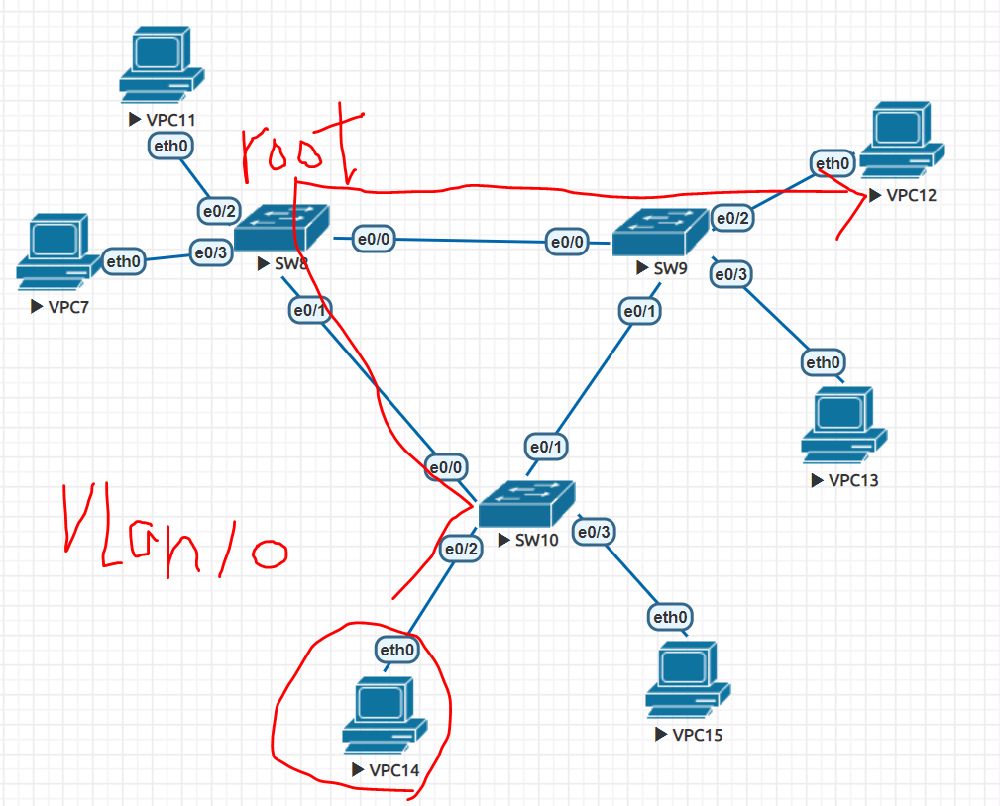

# 收斂時間


RIP

## STP
STP端口狀態

名稱 | 介紹
---|---
Blocking(阻塞狀態) |  執行阻塞端口
Listening(偵聽端口) | 執行端口選舉
Learning (學習狀態) | 執行地址 
Forwarding (轉發狀態) | 執行數據轉發

STP鏈路收斂
網路發生拓譜變更到鏈路重新回到穩定狀態的整個過程，由於STP存在端口狀態機，所以當鏈路發生變動，鏈路收斂需要經過一端時間，直連鏈路收斂需要經過三十秒，間接鏈路收斂需經過五十秒。

## STP增強特性
由於STP默認收斂速度緩慢，cisco提出
名稱|介紹
---|---
Portfast | 端口加速，用於加速用戶接入時間能加速三十秒
Uplinkfast | 上聯加速，用於加速直連鏈路收斂時間加速三十秒
Backbonefast | 骨幹加速，用於架速間接鏈路收斂時間能加速20秒

## example
SW8為vlan10 root，SW9為vlan20 root，這樣封包會怎樣傳?




> 提醒:先把三台SW建好trunk

SW8
```
spanning-tree vlan 10 root primary
spanning-tree vlan 20 root secondary
```
SW9
```
spanning-tree vlan 10 root primary
spanning-tree vlan 20 root secondary
```