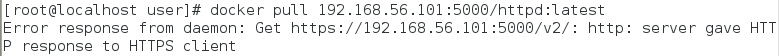

### 把image檔儲存在本機
優點:
1. 下載快速
2. 資料安全
#### 安裝registry
```
docker pull registry
```

```
docker run -d -p 5000:5000 --restart always --name registry registry:2
```
docker1
```
docker tag mysql:latest 192.168.56.101:5000/mysql:latest
docker push 127.0.0.1:5000/mysql:latest
```
docker2
```
docker pull 192.168.56.101:5000/mysql:latest
```

```
vim /etc/docker/daemon.json
```
寫入
```json
{"insecure-registries":["192.168.56.101:5000"]}
```
重開docker
```
systemctl  restart docker
```
在pull一次就可以了
```
docker pull 192.168.56.101:5000/mysql:latest
```
### 查看registry 有哪些image
```
curl -X GET http://192.168.56.101:5000/v2/_catalog
```
