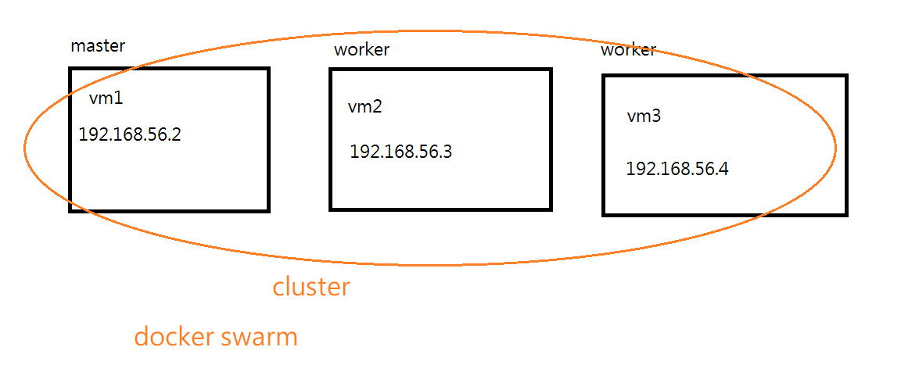
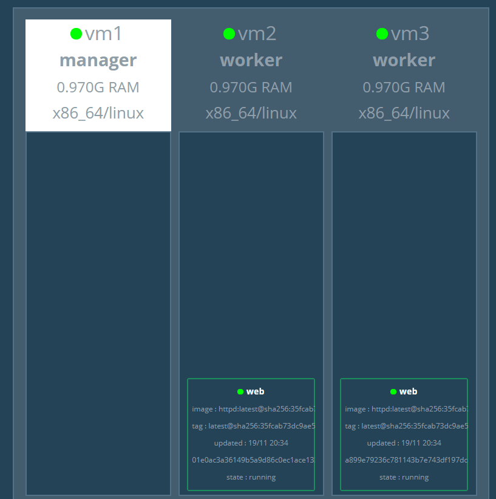

# 建立 Docker Swarm
https://docs.docker.com/engine/swarm/


vm1為managerV
```
# docker swarm init --advertise-addr 192.168.56.2
Swarm initialized: current node (hjbgw0w0u3hu9974gtxb1kofr) is now a manager.

To add a worker to this swarm, run the following command:

    docker swarm join --token SWMTKN-1-1pg6f1026ajr451qojrygun0q2rdpnn6oxyxsiu5jtwuzcty15-3f3brx9zar     25yk1z7lueh7vmt 192.168.56.2:2377

To add a manager to this swarm, run 'docker swarm join-token manager' and follow the instructions.
```
貼在vm2、vm3成為node
```
docker swarm join --token SWMTKN-1-1pg6f1026ajr451qojrygun0q2rdpnn6oxyxsiu5jtwuzcty15-3f3brx9zar     25yk1z7lueh7vmt 192.168.56.2:2377
```
查看node
```
# docker node ls
ID                            HOSTNAME            STATUS              AVAILABILITY        MANAGER STATUS      ENGINE VERSION
hjbgw0w0u3hu9974gtxb1kofr *   vm1                 Ready               Active               Leader              19.03.2
eej7ph3emz2ywz2594zdxe6zf     vm2                 Ready               Active                                  19.03.2
pnbskbsjs9ehgjdv9jlk7rzpr     vm3                 Ready               Active                                  19.03.2
```
建立service
```
#docker service create --name web httpd
#docker service ls
ID                  NAME                MODE                REPLICAS            IMAGE               PORTS
pebw7xwzu9v7        web                 replicated          1/1                 httpd:latest
# docker service ps web
ID                  NAME                IMAGE               NODE                DESIRED STATE       CURRENT STATE           ERROR               PORTS
79tlb3t63mcs        web.1               httpd:latest        vm1                 Running             Running 2 minutes ago
```
立即生成三個docker 
```
# docker service scale web=3
```
讓manager避免成為service
```
# docker node update --availability drain vm1
```
>用以下指令再改回去docker node update --availability active vm1 

移除整個web service
```
#docker service rm web
```
## example
用dockersamples/visualizer這工具來查看機器分布的狀態
```
docker pull dockersamples/visualizer
docker run -it -d -p 8080:8080 -v /var/run/docker.sock:/var/run/docker.sock dockersamples/visualizer
```
立即建立兩個httpd server
```
docker service create --name web --replicas 2 httpd
```
> replicas 副本

檢視是否建立起兩個網頁
```
# docker service ps web
ID                  NAME                IMAGE               NODE                DESIRED STATE       CURRENT STATE             ERROR               PORTS
u9fnkce731z0        web.1               httpd:latest        vm3                 Running             Running 52 seconds ago         
bw1sbeqjg008        web.2               httpd:latest        vm2                 Running             Running 23 seconds ago 
```

連上 http://192.168.56.2:8080/  



這個可以更方便檢視網也在哪個虛擬上面跑

### 添加port
```
docker service create --name web --replicas 2 -p 5555:80 httpd
```
http://192.168.56.3:5555/


> 我vm1 是沒有開啟網站的，但網址輸入192.168.56.2:5555也可以連到網頁，這是奇怪的!


\-----------------

可用busybox共用network來查看網路狀態
```
# docker ps
CONTAINER ID        IMAGE               COMMAND              CREATED             STATUS              PORTS               NAMES
ad8e1196dd32        httpd:latest        "httpd-foreground"   4 minutes ago       Up 4 minutes        80/tcp              web.1.n4356n7zulqf6k60ugatve6xx

docker run -it --network container:web.1.n4356n7zulqf6k60ugatve6xx busybox sh
```

