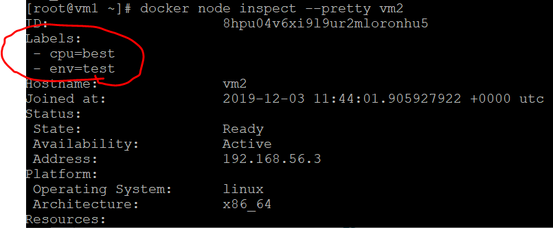
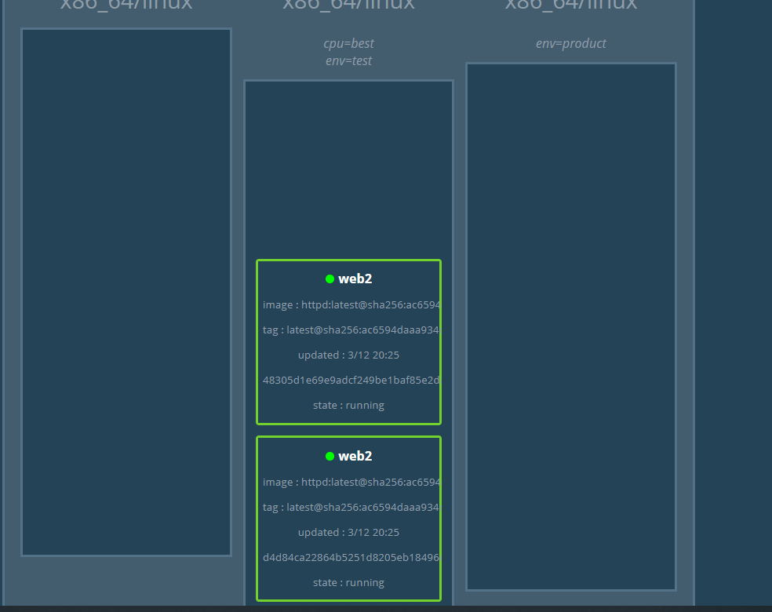
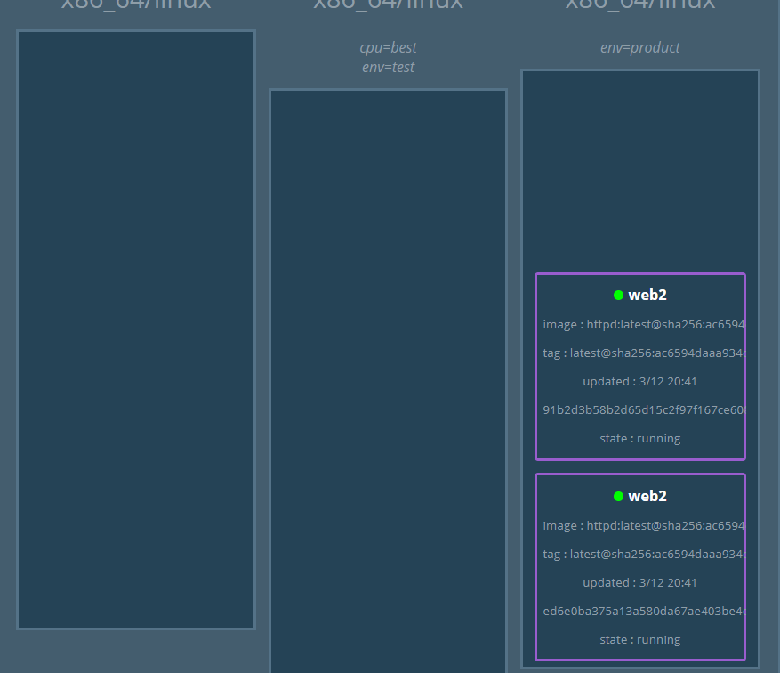

# relicas vs global mode

Swarm 可以在 service 创建或运行过程中灵活地通过 --replicas 调整容器副本的数量，内部调度器则会根据当前集群的资源使用状况在不同 node 上启停容器，这就是 service 默认的 replicated mode。在此模式下，node 上运行的副本数有多有少，一般情况下，资源更丰富的 node 运行的副本数更多，反之亦然。
除了 replicated mode，service 还提供了一个 globalmode，其作用是强制在每个 node 上都运行一个且最多一个副本。
此模式特别适合需要运行 daemon 的集群环境。比如要收集所有容器的日志，就可以 global mode 创建 service，在所有 node 上都运行 gliderlabs/logspout 容器，即使之后有新的 node 加入，swarm 也会自动在新 node 上启动一个 gliderlabs/logspout 副本。

[參考](https://www.ibm.com/developerworks/community/blogs/132cfa78-44b0-4376-85d0-d3096cd30d3f/entry/replicated_mode_vs_global_mode_%E6%AF%8F%E5%A4%A95%E5%88%86%E9%92%9F%E7%8E%A9%E8%BD%AC_Docker_%E5%AE%B9%E5%99%A8%E6%8A%80%E6%9C%AF_105?lang=en)

# update and rollback
原本建製好的server
```
docker service create --name web --replicas 2 httpd
```
## update
上傳要更新的server(httpd:aiphine)
```
docker service update --image httpd:alpine web
```
## rollback
還原回之前的版本
```
docker service update --rollback web
```

# Label
建置標籤
```
docker node update --label-add env=product vm3
docker node update --label-add cpu=best vm2
docker node update --label-add env=test vm2
```
查看label
```
docker node inspect --pretty vm2
```



啟用server在指定的標籤節點
```
docker service create --constraint node.labels.env==test --replicas 2 --name web2 httpd
```


把測試好的server轉到另一個節點上(env==product)
```
docker service update --constraint-rm node.labels.env==test web2
docker service update --constraint-add node.labels.env==product web2
```




