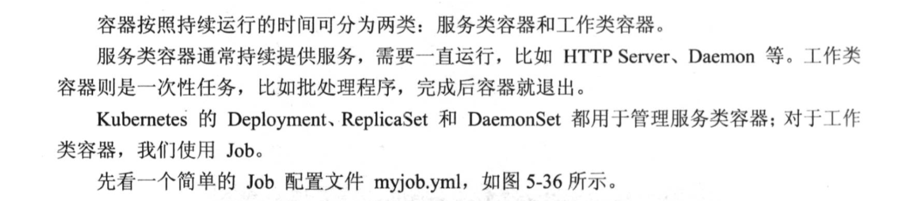

## Label
用標籤來控制建置在哪台機器上面

例如node1效能比較好，磁碟為ssd，所編籤node1
```
kubectl label node node1 disktype=ssd
```
文件建置時加入
```yaml
nodeSelector:
        disktype: ssd
```
能使pod建置在指定的機器上(node1)

```yaml
#nginx.yuml
apiVersion: apps/v1 # for versions before 1.9.0 use apps/v1beta2
kind: Deployment
metadata:
  name: nginx-deployment
spec:
  selector:
    matchLabels:
      app: nginx
  replicas: 6 # tells deployment to run 2 pods matching the template
  template:
    metadata:
      labels:
        app: nginx
    spec:
      containers:
      - name: nginx
        image: nginx:1.7.9
      nodeSelector:
        disktype: ssd
```
## 5.3 Job

```yml
apiVersion: batch/v1
kind: Job
metadata:
  name: myjob
spec:
  template:
    metadata:
      name: myjob
    spec:
      containers:
      - name: hello
        image: busybox
        command: ["echo", "hello k8s job! "]
      restartPolicy: Never
```
表示失敗不重啟
```yml
restartPolicy: Never
```
job失敗要重啟的話把restartPolicy改成OnFailure
```yml
restartPolicy: OnFailure
```
### 5.3.2 Job的並行性
可透過parallelism
```yml
apiVersion: batch/v1
kind: Job
metadata:
  name: myjob
spec:
  parallelism: 2
  template:
    metadata:
      name: myjob
    spec:
      containers:
      - name: hello
        image: busybox
        command: ["echo", "hello k8s job! "]
      restartPolicy: OnFailure
```
另外可透過completions設置job成功完成Pod的總數
```yml
apiVersion: batch/v1
kind: Job
metadata:
  name: myjob
spec:
  completions: 6
  parallelism: 2
  template:
    metadata:
      name: myjob
    spec:
      containers:
      - name: hello
        image: busybox
        command: ["echo", "hello k8s job! "]
      restartPolicy: OnFailure
```
上面配置意旨:每次運行兩個Pod，直到總共6個Pod成功完成
### 5.3.3 定時Job
CronJob此功能，類似於Linux的cron定時功能
```yml
apiVersion: batch/v1beta1
kind: CronJob
metadata:
  name: hello
spec:
  schedule: "*/1 * * * *"
  jobTemplate:
    spec:
      template:
        spec:
          containers:
          - name: hello
            image: busybox
            command: ["echo","hello k8s job!"]
          restartPolicy: OnFailure
```
```yml
schedule: "*/1 * * * *"
```
意旨每分鐘啟動一次