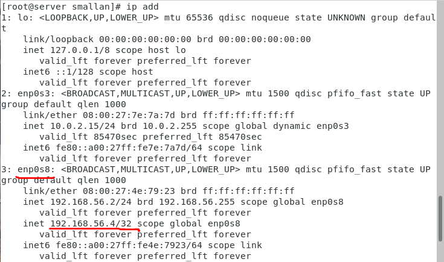
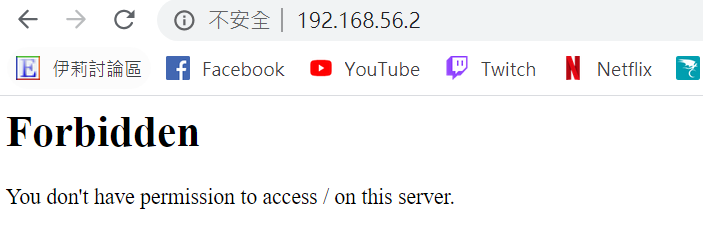

## 建置虛擬機
[學習網站](https://blog.csdn.net/tladagio/article/details/80760261)
### 1.添加基于多个IP的虚拟主机
```
[root@localhost ~]# cd /etc/httpd/conf.d/
[root@localhost conf.d]# vim virtual.conf
```
添加以下內容
```
<VirtualHost 192.168.56.2:80>
 ServerName a.com
 DocumentRoot "/var/www/html/a.com/"
</VirtualHost>

<VirtualHost 192.168.56.4:80>
 ServerName b.com
 DocumentRoot "/var/www/html/b.com/"
</VirtualHost>
```
在同網卡上添加ip
```
ip addr add 192.168.56.4 dev enp0s8
```
查看
```
ip add
```


重啟httpd
```
systemctl restart httpd
```

成果


### 2.配置基于IP+端口的虚拟主机
```
<VirtualHost 192.168.56.2:80>
 ServerName a.com
 DocumentRoot "/var/www/html/a.com/"
</VirtualHost>

<VirtualHost 192.168.56.2:8080>
 ServerName b.com
 DocumentRoot "/var/www/html/b.com/"
</VirtualHost>
```
成果


### 3.基于域名的虚拟主机
```
<VirtualHost *:80>
 ServerName a.com
 DocumentRoot "/var/www/html/a.com/"
</VirtualHost>

<VirtualHost *:80>
 ServerName b.com
 DocumentRoot "/var/www/html/b.com/" 
</VirtualHost>
```
## 擴展虛擬主機配置文件
```
vi /etc/httpd/conf/httpd.conf 
```
把 Require all denied默认拒绝访问设置为允许访问
```
<Directory "/var/www/html">
    AllowOverride none
    Require all denied
</Directory>
```

```
vi /etc/httpd/conf.d/virtual.conf
```
添加以下內容
```
<VirtualHost *:80>
    ServerName a.com
    ServerAlias www.test.com
    DocumentRoot /var/www/html/a.com/
    ErrorLog  /var/log/httpd/a.com/error_log
    CustomLog /var/log/httpd/a.com/access_log combined
    <Directory "/var/www/html/a.com/">
      Options FollowSymLinks
      AllowOverride All
      Require all granted
    </Directory>
</VirtualHost>
```
創建日誌目錄
```
[root@localhost b.com]# cd /var/log/httpd/
[root@localhost httpd]# mkdir a.com
[root@localhost httpd]# ll
总用量 60
-rw-r--r--. 1 root root 37976 1月  23 22:26 access_log
drwxr-xr-x. 2 root root     6 1月  23 22:41 a.com
-rw-r--r--. 1 root root 17795 1月  23 22:38 error_log
[root@localhost httpd]# cd a.com/
[root@localhost a.com]# touch error_log
[root@localhost a.com]# touch access_log
```
###類似範例
只允許單個或某網段連入
```
Require ip 192.168.56.3
Require ip 192.168.56.0/24
```
只允許本機server連入
vhost.conf
```
<Directory /var/www/html/secret>
    Require local
    Require all denied
</Directory>
```