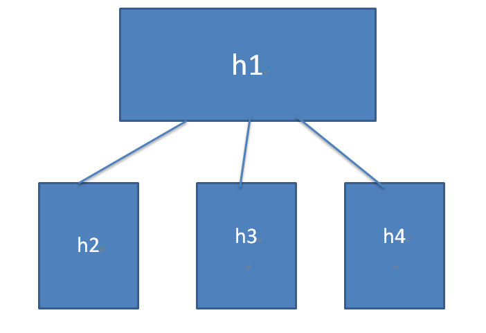
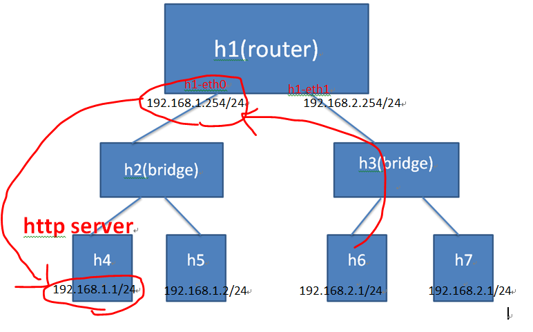
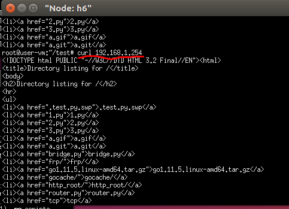

## [Linux系統] 實體機利用iptable轉發PORT號
[學習網站](https://andy6804tw.github.io/2019/01/20/ubuntu-iptable/)
用mininet模擬環境

```
#!/usr/bin/env python
from mininet.cli import CLI
from mininet.net import Mininet
from mininet.link import Link,TCLink,Intf

if '__main__' == __name__:

  net = Mininet(link=TCLink)

  h1 = net.addHost('h1')
  h2 = net.addHost('h2')
  h3 = net.addHost('h3')
  h4 = net.addHost('h4')
  Link(h1, h2)
  Link(h1, h3)
  Link(h1, h4)
  net.build()
  h1.cmd("ifconfig h1-eth0 0")
  h1.cmd("ifconfig h1-eth1 0")
  h1.cmd("ifconfig h1-eth2 0")
  h1.cmd("ifconfig h1-eth3 0")
  h1.cmd("brctl addbr br0")
  h1.cmd("brctl addif br0 h1-eth0")
  h1.cmd("brctl addif br0 h1-eth1")
  h1.cmd("brctl addif br0 h1-eth2")
  #h1.cmd("brctl setageing br0 0")       此設定可使bridge變成hub
  h1.cmd("ifconfig br0 up")

  CLI(net)

  net.stop()
```
## 將 80 PROT 轉向 8000 PORT
假設你已經寫好一隻 server 並監聽 8000 PORT 後，接下來我們要利用 iptables 來將連接到 80 PORT 的連線轉送到 8000 PORT。

iptables 有內建連接埠轉送 (port forwarding) 的功能，輸入以下指令便可將 port 80 導到 port 8000：
```
sudo iptables -t nat -A PREROUTING -p tcp --dport 80 -j REDIRECT --to-ports 8000
```
PREROUTING 規則會在封包進到介面卡的時候執行，也就是在從其他電腦連線進來的時候才會將外部要連到 80 PORT(–dport) 的連線轉送到 8000 PORT

上面指令是當外網連到主機時所進行的轉阜號動作，接下來要利用 OUTPUT 的規則，把從本機連到自己 (-d localhost)
```
sudo iptables -t nat -A OUTPUT -p tcp -d localhost --dport 80 -j REDIRECT --to-ports 8000
```


## 轉送到其他機器


```py
#!/usr/bin/env python
from mininet.cli import CLI
from mininet.net import Mininet
from mininet.link import Link,TCLink,Intf

if '__main__' == __name__:

  net = Mininet(link=TCLink)

  h1 = net.addHost('h1')
  h2 = net.addHost('h2')
  h3 = net.addHost('h3')
  h4 = net.addHost('h4')
  h5 = net.addHost('h5')
  h6 = net.addHost('h6')
  h7 = net.addHost('h7')
  Link(h1, h2)
  Link(h1, h3)
  Link(h2, h4)
  Link(h2, h5)
  Link(h3, h6)
  Link(h3, h7)
  net.build()
  h1.cmd("ifconfig h1-eth0 0")
  h1.cmd("ifconfig h1-eth1 0")
  h1.cmd("ifconfig h1-eth0 192.168.1.254 netmask 255.255.255.0")
  h1.cmd("ifconfig h1-eth1 192.168.2.254 netmask 255.255.255.0")
  h1.cmd("echo 1 > /proc/sys/net/ipv4/ip_forward")

  h2.cmd("ifconfig h2-eth0 0")
  h2.cmd("ifconfig h2-eth1 0")
  h2.cmd("ifconfig h2-eth2 0")
  h2.cmd("brctl addbr br0")
  h2.cmd("brctl addif br0 h2-eth0")
  h2.cmd("brctl addif br0 h2-eth1")
  h2.cmd("brctl addif br0 h2-eth2")
 
  h3.cmd("ifconfig h3-eth0 0")
  h3.cmd("ifconfig h3-eth1 0")
  h3.cmd("ifconfig h3-eth2 0")
  h3.cmd("brctl addbr br0")
  h3.cmd("brctl addif br0 h3-eth0")
  h3.cmd("brctl addif br0 h3-eth1")
  h3.cmd("brctl addif br0 h3-eth2")

  h4.cmd("ifconfig h4-eth0 0")
  h5.cmd("ifconfig h5-eth0 0")
  h6.cmd("ifconfig h6-eth0 0")
  h7.cmd("ifconfig h7-eth0 0")
  h4.cmd("ip addr add 192.168.1.1/24 dev h4-eth0")
  h5.cmd("ip addr add 192.168.1.2/24 dev h5-eth0")
  h6.cmd("ip addr add 192.168.2.1/24 dev h6-eth0")
  h7.cmd("ip addr add 192.168.2.2/24 dev h7-eth0")
  #route
  h4.cmd("ip route add default via 192.168.1.254 dev h4-eth0")
  h5.cmd("ip route add default via 192.168.1.254 dev h5-eth0")
  h6.cmd("ip route add default via 192.168.2.254 dev h6-eth0")
  h7.cmd("ip route add default via 192.168.2.254 dev h7-eth0")

  h2.cmd("ifconfig br0 up")
  h3.cmd("ifconfig br0 up")

  CLI(net)
  net.stop()
```
[學習網站](https://caloskao.org/linux-iptables-ipport-forwarding/)

開啟路由器功能
```
# 注意: 這邊必須以root權限操作，請切換成root或是sudo vim用編輯器編輯
# 方法一：直接echo 1到檔案，這個方式是暫時開啟，重開機後會消失，如果你只是想要暫時當一下Router可以用這種方式 (1為開啟，0為關閉)
root@localhost:~$ echo 1 > /proc/sys/net/ipv4/ip_forward

# 方法二：使用sysctl進行設定，效果等同第一種方法 (1為開啟，0為關閉)
root@localhost:~$ sysctl net.ipv4.ip_forward=1

# 方法三：將上述兩種方法其中一種指令加到/etc/network/interfaces，這樣子每次網路卡重啟時皆會自動開啟轉送，但如果要當下生效的話還是要先利用上面提到的方法
root@localhost:~$ echo 'pre-up sysctl net.ipv4.ip_forward=1' >> /etc/network/interfaces
```
```
轉送外來tcp port 80封包到內網機器192.168.0.1的port 80
iptables -t nat -A PREROUTING -p tcp --dport 80 -j DNAT --to 192.168.1.1:80
iptables -t nat -A POSTROUTING -p tcp --dport 80 --dst 192.168.1.1 -j MASQUERADE
```
