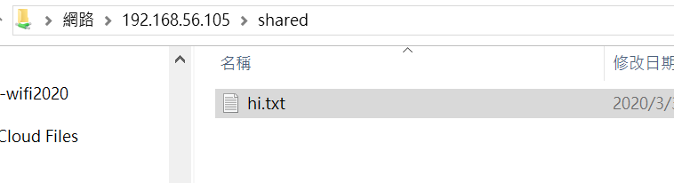

# samba
## 在ubuntu建立 
```
sudo apt-get install samba samba-common
```
```
vim /etc/samba/smb.conf
```
添加以下內容
```
[share]
path = /home/share
available = yes     ##vailable用來指定該共享資源是否可用
browsable = yes    ##browseable用來指定該共享是否可以瀏覽
public    = yes    ##public用來指定該共享是否允許guest賬戶訪問
writable  = yes  ##writable用來指定該共享路徑是否可寫
```
到/home新建資料夾share並修改許可權為777    
4. 重啟samba服務sudo service samba restart
ubuntu1604版本使用sudo systemctl restart smbd.service命令重啟     
5. 到檔案總管，輸入相應虛擬機器上的linux系統的ip


參考資料:
https://magiclen.org/ubuntu-server-samba/
https://codertw.com/%E7%A8%8B%E5%BC%8F%E8%AA%9E%E8%A8%80/551077/
https://tsaiyuyan.github.io/2019/04/09/ubuntu-she-ding-samba-fen-xiang-dang-an/

## 在centos7 建立
https://www.itread01.com/content/1529403606.html

## 配置多用户SMB 挂载
https://blog.csdn.net/yangxjsun/article/details/79312043
https://blog.cmrdb.cs.pu.edu.tw/?p=1020