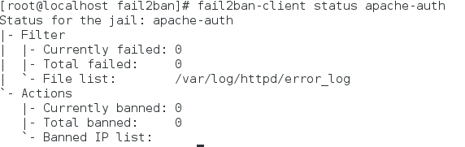

## Fail2ban 防範 暴力破解web

### 環境介紹
client端、hacker端作業系統皆為centos7 

hacker端暴力破解為hydra  (攻擊手段就不講述了)
client端防護方法為fail2ban

### Fail2ban規則編寫
#### 規則檔編寫 
從log檔中發現駭客攻擊的話，就把駭客的ip ban掉，可以設定要ban多久
* ban IP的功能主要是結合iptables

/etc/fail2ban/jail.conf
添加以下內容 
```python
[apache-auth]   ##名稱
enabled = true  ##啟用
filter = httpd    ##過濾檔名稱
action = iptables-multiport[name=http, port="http,https",protocol=tcp]               ##動作
       sendmail-whois[name=http, dest=zz860926@gmail.com, sender=fail2ban]      ##能寄送email
logpath  = /var/log/httpd/error_log       ##log檔位置
maxretry = 10                       # 登入失敗幾次封鎖 
findtime = 60                        
bandtime = 120                      #被ban的時間
```
#### 過濾器編寫
過濾器的作用是在log檔中比對出駭客攻擊的訊息
```
vim /etc/fail2ban/filter.d/httpd.conf
```
寫入以下內容
```python
# Fail2Ban httpd filter
#
[INCLUDES]
# Read common prefixes. If any customizations available -- read them from
# apache-common.local
before = apache-common.conf

[Definition]

failregex = client <HOST>.* PHP Notice:  Undefined index: \S+ in /var/www/html/hackerproof/login.php on line
ignoreregex =
```
* 主要是failregex的內容
```pythone
failregex = client <HOST>.* PHP Notice:  Undefined index: \S+ in /var/www/html/hackerproof/login.php on line
```
* 此fail2ban是用python寫的，所以過濾器的正規表達式也是用python的

* 為什麼要這樣寫過濾檔呢?
因為去觀察 被暴力破解後所產生的log檔，針對其內容去再加上正規表達式去比對裡面的訊息
/var/log/httpd/error_log


* 那如何知道所寫的語法有沒有比對到log的內容呢?

使用以下指令
```
fail2ban-regex /var/log/httpd/error_log /etc/fail2ban/filter.d/httpd
```

* 會有顯示match到多少筆，代表到現在已被攻擊的次數

以上規則都制定好了後，啟用fail2ban
```
systemctl start fail2ban
```
觀察現在狀態
```
fail2ban-client status apache-auth
```

如果駭客攻擊的話，可以把對方的ip ban掉


再來觀察iptables的狀況
```
iptables -list
```


確實iptables有把駭客的ip給ban掉了!
駭客端想要連此ip的話就會連不上，只能等bantime時間結束為止

資料來源: http://www.vixual.net/blog/archives/252