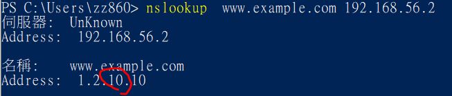
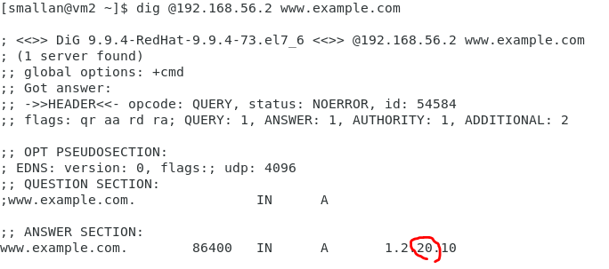

# DNS server

* hosts 設定檔位置
windows : C:\Windows\System32\drivers\etc\hosts
linux : /etc/hosts

* 查詢指令
linux : host、dig
windows : nslookup

智能DNS:
能根據來源不同對相同Damain Name 給出不同答案
例子：
CDN(content delivery network)
youtobe 針對亞洲的人，連亞洲的server

##　腳本設計
```bash
#!/usr/bin/bash
name=$1
if [ $# -ne 1 ]; then
   echo "`basename $0` domain_name (e.g.`basename $0` www.pchome.com.tw)"
   exit 1
fi

answer=$(host $name | awk '{print $4}')
echo "$name's ip :" $answer
```
> basename vs dirname
[root@local ~]# basename /usr/bin/sort 
sort
[root@local ~]# dirname /usr/bin/sort       	
/usr/bin

執行
```
$ ./mylookup.sh
mylookup.sh domain_name (e.g.mylookup.sh www.pchome.com.tw)
$ ./mylookup.sh www.pchome.com.tw
www.pchome.com.tw's ip : 210.59.230.39
```
如果要設計不給root使用的話可以加入以下內容
```bash
if [ $UID -eq 0 ];then
   echo "don't use root"
   exit 2
fi
```
腳本指令細節
```
$#           添加到Shell的参数个数 
-eq           //等于
-ne           //不等于
-gt           //大于
-lt           //小于
ge            //大于等于
le            //小于等于
```

## 建立DNS server

```
yum install -y bind bind-chroot bind-utils
systemctl start named
```
查看port是否開啟
```
# netstat -tunlp|grep named
tcp        0      0 127.0.0.1:53            0.0.0.0:*               LISTEN      6824/named          
tcp        0      0 127.0.0.1:953           0.0.0.0:*               LISTEN      6824/named          
tcp6       0      0 ::1:53                  :::*                    LISTEN      6824/named          
tcp6       0      0 ::1:953                 :::*                    LISTEN      6824/named          
udp        0      0 127.0.0.1:53            0.0.0.0:*                           6824/named          
udp6       0      0 ::1:53                  :::*                                6824/named     
```
可以查看到127.0.0.1:53代表只能本機端可以連到

那如果其他機器也要連的話怎麼弄呢?

```
vi /etc/named.conf
//
// named.conf
//
// Provided by Red Hat bind package to configure the ISC BIND named(8) DNS
// server as a caching only nameserver (as a localhost DNS resolver only).
//
// See /usr/share/doc/bind*/sample/ for example named configuration files.
//
// See the BIND Administrator's Reference Manual (ARM) for details about the
// configuration located in /usr/share/doc/bind-{version}/Bv9ARM.html

options {
        listen-on port 53 { any; };
        listen-on-v6 port 53 { ::1; };
        directory       "/var/named";
        dump-file       "/var/named/data/cache_dump.db";
        statistics-file "/var/named/data/named_stats.txt";
        memstatistics-file "/var/named/data/named_mem_stats.txt";
        recursing-file  "/var/named/data/named.recursing";
        secroots-file   "/var/named/data/named.secroots";
        allow-query     { any; };

```
把這兩個改成any就可以了
```
listen-on port 53 { any; };
allow-query     { any; };
```
windows的主機也能連到了
```
PS C:\Users\zz860> nslookup www.pchome.com.tw 192.168.56.2
伺服器:  UnKnown
Address:  192.168.56.2

未經授權的回答:
名稱:    www.pchome.com.tw
Address:  210.59.230.39
```

## 習題:
```bash
#!/bin/bash

name=$1
answer=$(host -t ns google.com | awk '{print $4}')
for i in $answer
do
   ans=$(host $i | head -n 1 | awk '{print $4}')
   echo "the ip addr of name server ($i): $ans"
done
```
```
$ bash mylookup2.sh 
the ip addr of name server (ns2.google.com.): 216.239.34.10
the ip addr of name server (ns1.google.com.): 216.239.32.10
the ip addr of name server (ns3.google.com.): 216.239.36.10
the ip addr of name server (ns4.google.com.): 216.239.38.10
```
---------------------------------
## 管理一個網域
### 1.新增網域設定區塊 - /etc/named.rfc1912.zones
```
[root@vm1 smallan]# vi /etc/named.rfc1912.zones
..
zone "test.com" IN {
        type master;
        file "named.test";
        allow-update { none; };
};
```
### 2.新增網域資源記錄檔 - /var/named.test
```
[root@vm1 smallan]# vi /var/named/named.test
$TTL 1D
@      IN  SOA    test.com. (
       0
       1D
       1H
       1W
       3H )

       NS  @
       A   1.2.3.4
www    A   1.2.3.10              
```
### 3.更改資源記錄檔之權限
```
chown root:named /var/named/named.test
```
### 4.重啟named服務
```
systemctl restart named
```
### 5.測試與驗證
先在本機上測試
```
dig @localhost www.test.com
www.test.com.		86400	IN	A	1.2.3.10
```
本機上用dns ip測試
```
dig @192.168.56.2 www.test.com
www.test.com.		86400	IN	A	1.2.3.10
```
在windows上測試
```
nslookup www.test.com 192.168.56.2
名稱:    www.test.com
Address:  1.2.3.10
```
## DNS view 
簡單來說可針對不同連入的ip網段位置，來進行不同的策略處理，例如youtobe針對亞洲客戶給予連去亞洲區的server，避免連到美國花費不必要的寬頻;另外中國針對台灣連入的客戶進行區域封鎖
### 實作配置
server :
1. ip : 192.168.56.2
2. os : centos 7

slave1 : 
1. ip : 192.168.56.1
2. os : windows 10

slave2 : 
1. ip : 192.168.56.3
2. os : centos 7
### 設定檔
這邊設定ip為192.168.56.1連入時，做A部分操作，其他連入ip都執行B部分操作
```
 vi /etc/named.conf 
    54	#zone "." IN {
    55	#	type hint;
    56	#	file "named.ca";
    57	#};
    58	
    59	#include "/etc/named.rfc1912.zones";
    60	include "/etc/named.root.key";
    61	
    62	view "A" {
    63	        match-clients {192.168.56.1;};   
    64	        zone "example.com" IN {
    65	                 type master;
    66	                 file "a.example.com.zone";
    67	        };
    68	};
    69	
    70	view "B" {
    71	       match-clients {any;};
    72	        zone "example.com" IN {
    73	                 type master;
    74	                 file "b.example.com.zone";
    75	        };
    76	#include "/etc/named.rfc1912.zones";
    77	};
```
> 通常不會只設ip，而是會設定整個網段，例如192.168.56.0/24，但這邊先做簡單的測試，所以先這樣設
### 編寫資源記錄檔
建立兩個檔案
```
root@vm1 smallan]# ls -l /var/named/
total 32
-rw-r--r-- 1 root  named  188 Mar 18 11:52 a.example.com.zone
-rw-r--r-- 1 root  named  188 Mar 18 11:53 b.example.com.zone
```
A檔案主要ip為1.2.10.10
```
vi /var/named/a.example.com.zone
$TTL 1D
@      IN  SOA    example.com. admin.mydomain.com. (
       0
       1D
       1H
       1W
       3H )

       NS  @
       A   1.2.10.10
www    A   1.2.10.10
```
B檔案主要ip為1.2.20.10
```
vi /var/named/b.example.com.zone
$TTL 1D
@      IN  SOA    example.com. admin.mydomain.com. (
       0
       1D
       1H
       1W
       3H )

       NS  @
       A   1.2.20.10
www    A   1.2.20.10
```
然後重啟named server
```
systemctl restart named
```
### 測試與驗證
從192.168.56.1連入


從192.168.56.2連入


因為有設定從192.168.56.1連入時會特別處理，所以這邊會顯示不同的結果，這DNS view，可運用在針對不同連入的ip位置來做處理

